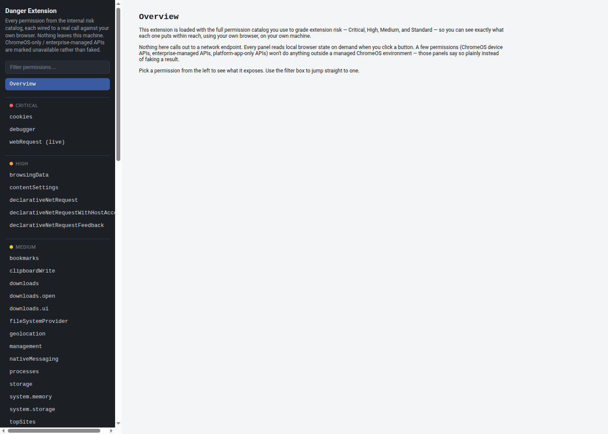
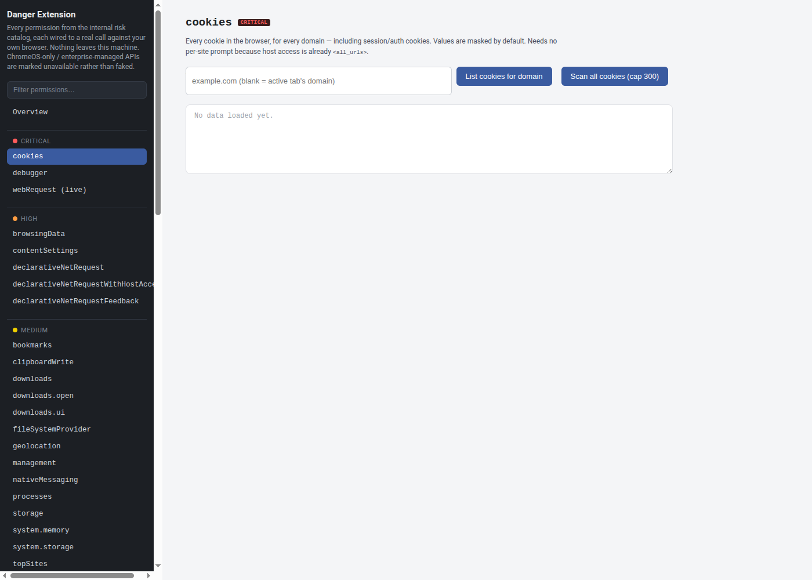
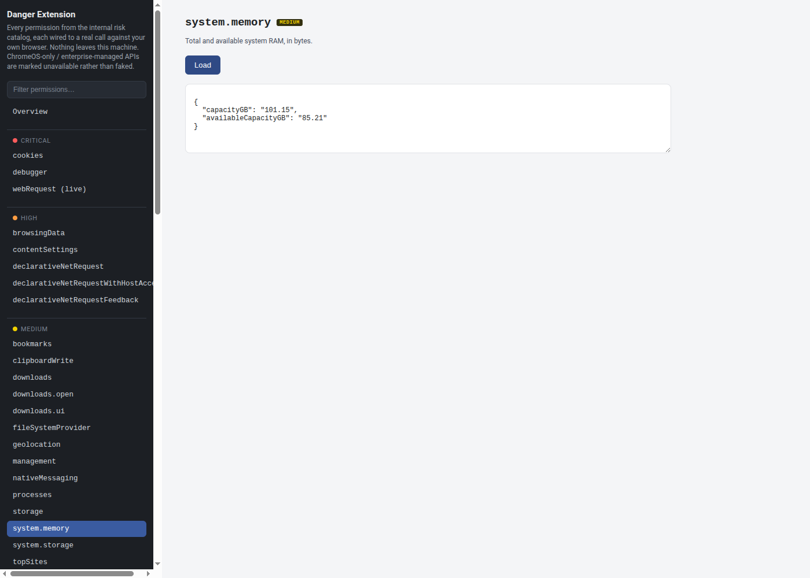

# Danger Extension

**DEMO ONLY — not for distribution.**

A Chrome (Manifest V3) extension that loads the *entire* internal permission
risk catalog — Critical, High, Medium, and Standard — and wires each
permission to a real, live call against your own browser. It exists so you
can see exactly what a given permission puts within reach, without taking
anyone's word for it.

Nothing in this extension calls out to a network endpoint. Every panel reads
local browser state on demand, only when you click a button, on your own
machine. A couple of panels display an inert example of the one extra line
of code it would take to ship captured data off-device (e.g. a `fetch()` to
an attacker's server) — that line is shown as text only and is never
executed. A few permissions (ChromeOS device APIs, enterprise-managed APIs,
platform-app-only APIs) are marked as unavailable outside a managed ChromeOS
environment instead of faking a result.

## Screenshots

| Catalog overview | Panel detail | Live call |
|---|---|---|
|  |  |  |

## Why this exists

Reviewing extension permission requests usually means reading a name like
`debugger` or `nativeMessaging` and trusting a description of what it can
do. This project inverts that: install it, grant the permissions, and click
through the catalog to see the actual capability each one unlocks in a real
browser session. It's a teaching/reference tool for grading extension risk,
not a browser extension meant for general use.

The `debugger: Network capture` and `scripting: Invisible network capture`
panels make the same point two ways: both capture full request/response
traffic (headers, bodies, tokens) for a tab, but only the `debugger` one
triggers Chrome's unhidable "is debugging this browser" banner. The
`scripting` version — a permission this catalog tags Standard, not Critical
— does the same thing with no on-screen indicator at all. The tag on a
permission is a starting point, not the whole risk picture.

See [PERMISSIONS.md](PERMISSIONS.md) for the full list of permissions this extension demonstrates,
grouped by risk tier.

## Structure

- `manifest.json` — Manifest V3 config declaring the full permission catalog
  and a locked-down CSP for the extension pages.
- `background.js` — service worker wiring for permission-backed calls.
- `dashboard.html` / `dashboard.css` / `dashboard.js` — the inspector UI:
  a searchable catalog of permissions, each opening a panel that exercises
  that permission live.
- `offscreen.html` / `offscreen.js` — offscreen document used where an API
  requires one (e.g. audio/clipboard operations unavailable to a service
  worker directly).

## Running it locally

1. Open `chrome://extensions`.
2. Enable **Developer mode**.
3. Click **Load unpacked** and select this directory.
4. Open the extension's dashboard from the toolbar icon and grant the
   permission prompts as needed to explore each panel.

## Scope and warnings

- This extension intentionally requests `<all_urls>` host permissions and a
  large set of high-risk permissions (e.g. `debugger`, `webRequest`,
  `scripting`, `nativeMessaging`, `management`, `cookies`). That is the
  point of the demo — do not adapt this manifest for a real, shipped
  extension.
- **Cookie export is for education and authorized testing only.** The cookies
  panel can export live session/auth cookies, including an *import-ready* file
  that loads directly into a cookie-editor extension. Loading those cookies
  into another browser is the **"pass-the-cookie"** technique and can
  impersonate a logged-in session without a password or MFA. Only ever do this
  against accounts and systems **you own or are explicitly authorized to
  test** — using someone else's session cookies without permission is
  unauthorized access and illegal in most jurisdictions. The extension itself
  only reads and displays these cookies locally and performs no replay; what
  you do with an exported file is your responsibility.
- Do not publish this to the Chrome Web Store or distribute the packed
  extension to end users.
- See [SECURITY.md](SECURITY.md) for responsible use and disclosure notes.

## License

MIT — see [LICENSE](LICENSE).
